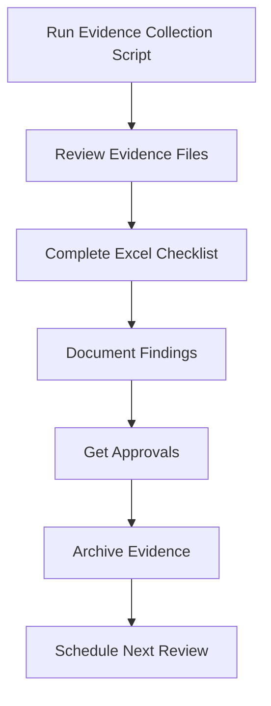

# OCP4 CIS Compliance Toolkit

> Comprehensive toolkit for OpenShift Container Platform 4 CIS Benchmark compliance assessment, evidence collection, and reporting.

[](https://opensource.org/licenses/MIT)
[](https://www.openshift.com/)
[](https://www.cisecurity.org/)

## 📋 Table of Contents

- [Overview](#overview)
- [Features](#features)
- [Prerequisites](#prerequisites)
- [Quick Start](#quick-start)
- [Tools Included](#tools-included)
- [Usage Guide](#usage-guide)
- [Output Files](#output-files)
- [MANUAL Controls Coverage](#manual-controls-coverage)
- [Workflow](#workflow)
- [Best Practices](#best-practices)
- [Troubleshooting](#troubleshooting)
- [Contributing](#contributing)
- [License](#license)

## 🎯 Overview

This toolkit helps security teams, platform engineers, and auditors assess OpenShift Container Platform 4 (OCP4) compliance against the CIS Benchmark. It focuses on **MANUAL controls** that require human review and provides:

- **Automated evidence collection** for all 22 MANUAL controls
- **Excel-based compliance tracking** with 6 comprehensive sheets
- **Review checklists** and approval workflows
- **Remediation guides** for failed controls

### Why This Toolkit?

The CIS Benchmark for OCP4 includes controls that cannot be automatically verified by the Compliance Operator. These MANUAL controls require:
- Human judgment and review
- Business context understanding
- Organizational policy alignment
- Documentation and approval

This toolkit streamlines the entire process.

## ✨ Features

### 🤖 Auto-Collection Script
- ✅ **READ-ONLY** - Safe to run on production clusters
- ✅ Collects evidence for all 22 MANUAL controls
- ✅ Organized output in 8 categorized files
- ✅ Color-coded console output
- ✅ Error handling and validation
- ✅ No dependencies except `oc` and `jq`

### 📊 Excel Compliance Report
- ✅ **6 Comprehensive Sheets:**
  - Dashboard (overview statistics)
  - All Controls (complete inventory)
  - Failed Controls (remediation tracker)
  - Manual Review (approval workflow)
  - Remediation Guide (step-by-step fixes)
  - Manual Controls Guide (review commands)
- ✅ Color-coded status indicators
- ✅ Formulas for automatic calculations
- ✅ Ready-to-use templates

### 📝 Documentation
- ✅ Detailed review checklist
- ✅ Evidence mapping to controls
- ✅ Approval signature sections
- ✅ Compliance summary reports

## 🔧 Prerequisites

### Required Software
- OpenShift CLI (`oc`) - version 4.6+
- `jq` - JSON processor
- `bash` - version 4.0+

### Required Access
- OpenShift cluster access
- Permissions needed:
  - `get`, `list`, `describe` for most resources
  - No `create`, `update`, `delete` permissions required
  - Recommended: `cluster-reader` role or equivalent

### Optional
- OpenShift Compliance Operator (installed)
- CIS compliance scan completed

## 🚀 Quick Start

### 1. Clone Repository
```bash
git clone https://github.com/yourusername/ocp4-cis-compliance-toolkit.git
cd ocp4-cis-compliance-toolkit
```

### 2. Login to OpenShift
```bash
oc login <your-cluster-url>
```

### 3. Run Evidence Collection
```bash
chmod +x collect-manual-controls-evidence.sh
./collect-manual-controls-evidence.sh
```

### 4. Review Evidence
```bash
cd /tmp/ocp4-cis-manual-evidence-<timestamp>
ls -la
```

### 5. Complete Excel Report
1. Open `OCP4_CIS_Compliance_Report_v2.xlsx`
2. Navigate to "Manual Review" sheet
3. Fill in findings from evidence files
4. Get approvals
5. Archive for audit

## 🛠️ Tools Included

### `collect-manual-controls-evidence.sh`

**Purpose:** Automated evidence collection for MANUAL controls

**Features:**
- Collects evidence for 22 MANUAL controls
- Generates 8 organized evidence files
- Creates review checklist template
- Summary report with statistics

**Usage:**
```bash
./collect-manual-controls-evidence.sh
```

**Output Location:**
```
/tmp/ocp4-cis-manual-evidence-YYYYMMDD-HHMMSS/
```

### `OCP4_CIS_Compliance_Report_v2.xlsx`

**Purpose:** Comprehensive compliance tracking and reporting

**Sheets:**
1. **Dashboard** - Overview statistics and trends
2. **All Controls** - Complete control inventory (235+ controls)
3. **Failed Controls** - Remediation tracking for FAIL status
4. **Manual Review** - Approval workflow for MANUAL controls
5. **Remediation Guide** - Step-by-step fixes for failed controls
6. **Manual Controls Guide** - Review commands for all 22 MANUAL controls

## 📤 Output Files

### Evidence Files Generated

```
ocp4-cis-manual-evidence-YYYYMMDD-HHMMSS/
├── 00-SUMMARY.txt                    # Collection summary
├── 01-rbac-controls.txt              # RBAC evidence
│   ├── cluster-admin bindings
│   ├── Wildcard permissions
│   ├── Secrets access
│   └── Pod creation access
├── 02-scc-controls.txt               # SCC evidence
│   ├── Privileged containers
│   ├── Root containers
│   ├── Capabilities
│   └── Host namespace access
├── 03-namespace-controls.txt         # Namespace evidence
│   ├── Default namespace usage
│   ├── Namespace inventory
│   └── Seccomp profiles
├── 04-secrets-controls.txt           # Secrets evidence
│   ├── Environment variable usage
│   └── External secret management
├── 05-serviceaccount-controls.txt    # Service Account evidence
│   ├── Token auto-mounting
│   └── Default SA usage
├── 06-compliance-results.txt         # Compliance Operator output
├── 07-cluster-info.txt               # Cluster metadata
└── 08-REVIEW-CHECKLIST.txt           # Manual review template
```

## 📋 MANUAL Controls Coverage

This toolkit covers **all 22 MANUAL controls** from CIS OCP4 Benchmark:

### RBAC Controls (5)
- ✅ `ais-ocp4-cis-rbac-least-privilege` (HIGH)
- ✅ `ais-ocp4-cis-rbac-limit-cluster-admin` (MEDIUM)
- ✅ `ais-ocp4-cis-rbac-limit-secrets-access` (MEDIUM)
- ✅ `ais-ocp4-cis-rbac-pod-creation-access` (MEDIUM)
- ✅ `ais-ocp4-cis-rbac-wildcard-use` (MEDIUM)

### SCC Controls (9)
- ✅ `ais-ocp4-cis-scc-limit-privileged-containers` (MEDIUM)
- ✅ `ais-ocp4-cis-scc-limit-root-containers` (MEDIUM)
- ✅ `ais-ocp4-cis-scc-limit-privilege-escalation` (MEDIUM)
- ✅ `ais-ocp4-cis-scc-drop-container-capabilities` (MEDIUM)
- ✅ `ais-ocp4-cis-scc-limit-net-raw-capability` (MEDIUM)
- ✅ `ais-ocp4-cis-scc-limit-ipc-namespace` (MEDIUM)
- ✅ `ais-ocp4-cis-scc-limit-network-namespace` (MEDIUM)
- ✅ `ais-ocp4-cis-scc-limit-process-id-namespace` (MEDIUM)
- ✅ `ais-ocp4-cis-general-apply-scc` (MEDIUM)

### General Controls (4)
- ✅ `ais-ocp4-cis-general-default-namespace-use` (MEDIUM)
- ✅ `ais-ocp4-cis-general-default-seccomp-profile` (MEDIUM)
- ✅ `ais-ocp4-cis-general-namespaces-in-use` (MEDIUM)

### Secrets Controls (2)
- ✅ `ais-ocp4-cis-secrets-consider-external-storage` (MEDIUM)
- ✅ `ais-ocp4-cis-secrets-no-environment-variables` (MEDIUM)

### Service Account Controls (2)
- ✅ `ais-ocp4-cis-accounts-restrict-service-account-tokens` (MEDIUM)
- ✅ `ais-ocp4-cis-accounts-unique-service-account` (MEDIUM)

## 🔄 Workflow



### Detailed Steps

1. **Preparation**
   - Login to OpenShift cluster
   - Verify Compliance Operator scan completed (optional)

2. **Evidence Collection**
   ```bash
   ./collect-manual-controls-evidence.sh
   ```
   - Takes 2-3 minutes
   - Generates 8 evidence files
   - Creates review checklist

3. **Review Process**
   - Open evidence files
   - Review each control against checklist
   - Document findings and justifications
   - Mark as Compliant/Non-Compliant

4. **Excel Tracking**
   - Open Excel report
   - Fill "Manual Review" sheet
   - Add evidence file references
   - Set review dates

5. **Approval**
   - Reviewer signs off
   - Security Manager approves
   - CISO final approval

6. **Archive**
   ```bash
   tar -czf ocp4-cis-evidence-YYYYMMDD.tar.gz ocp4-cis-manual-evidence-*/
   ```
   - Store for audit
   - Retention per policy

7. **Schedule Next Review**
   - Quarterly recommended
   - Update Excel tracker

## 💡 Best Practices

### Before Running

- [ ] **Test in non-production first** - Validate output format
- [ ] **Check cluster connectivity** - `oc whoami`
- [ ] **Verify jq installation** - `jq --version`
- [ ] **Review script contents** - Ensure read-only operations
- [ ] **Check available disk space** - Evidence files ~5-10MB

### During Collection

- [ ] **Monitor console output** - Watch for errors
- [ ] **Don't interrupt** - Let script complete
- [ ] **Save terminal output** - For troubleshooting
- [ ] **Note any warnings** - Document in findings

### After Collection

- [ ] **Verify all files created** - Check 8 files present
- [ ] **Review summary file first** - `00-SUMMARY.txt`
- [ ] **Check for errors** - Look for "Error collecting data"
- [ ] **Archive immediately** - Create tarball
- [ ] **Document collection metadata** - Date, cluster, version

### Review Process

- [ ] **One control at a time** - Don't rush
- [ ] **Document everything** - Even if compliant
- [ ] **Provide justifications** - For each finding
- [ ] **Include evidence** - File names and sections
- [ ] **Get proper approvals** - Required signatures
- [ ] **Schedule next review** - Quarterly recommended

## 🐛 Troubleshooting

### Common Issues

#### 1. `oc` command not found
```bash
# Solution: Install OpenShift CLI
# macOS
brew install openshift-cli

# Linux
wget https://mirror.openshift.com/pub/openshift-v4/clients/ocp/latest/openshift-client-linux.tar.gz
tar -xzf openshift-client-linux.tar.gz
sudo mv oc /usr/local/bin/
```

#### 2. `jq` command not found
```bash
# Solution: Install jq
# macOS
brew install jq

# Linux
sudo yum install jq  # RHEL/CentOS
sudo apt install jq  # Ubuntu/Debian
```

#### 3. Not logged in to cluster
```bash
# Solution: Login first
oc login <cluster-url>
```

#### 4. Permission denied errors
```bash
# Solution: Check permissions
oc auth can-i get pods --all-namespaces
oc auth can-i list clusterroles

# Request cluster-reader role if needed
```

#### 5. Empty output files
```bash
# Possible causes:
# 1. No resources found (expected for some controls)
# 2. Network issues
# 3. API errors

# Check:
oc get pods --all-namespaces  # Test basic connectivity
```

#### 6. "Error collecting data" messages
```bash
# Common causes:
# 1. Resource doesn't exist (normal)
# 2. Insufficient permissions
# 3. API timeout

# Review specific section in evidence file
# Document in findings if needed
```

### Debug Mode

Add debug output:
```bash
# Edit script, add at top:
set -x  # Enable debug output

# Or run with bash -x
bash -x collect-manual-controls-evidence.sh
```

### Getting Help

1. **Check logs** - Review console output
2. **Verify prerequisites** - `oc`, `jq`, permissions
3. **Test individual commands** - From evidence files
4. **Open GitHub issue** - With error details

## 📊 Sample Evidence Output

### RBAC Controls
```
─────────────────────────────────────────────────────────────
1.1 cluster-admin Role Bindings
Control: ais-ocp4-cis-rbac-limit-cluster-admin
─────────────────────────────────────────────────────────────

Command:
oc get clusterrolebindings -o json | jq -r '.items[] | 
  select(.roleRef.name=="cluster-admin") | 
  {binding: .metadata.name, subjects: .subjects}'

Output:
{
  "binding": "cluster-admin",
  "subjects": [
    {"kind": "User", "name": "system:admin"},
    {"kind": "ServiceAccount", "name": "argocd-sa", "namespace": "argocd"}
  ]
}

Summary:
Total cluster-admin bindings: 2
```

## 🔐 Security Considerations

### Script Safety

✅ **READ-ONLY Operations**
- Script only performs `get`, `list`, `describe`
- No `create`, `update`, `patch`, `delete` operations
- No configuration changes
- Safe for production clusters

✅ **Data Privacy**
- Evidence files contain cluster metadata
- May include internal resource names
- Store securely per security policy
- Sanitize before sharing externally

✅ **Credentials**
- Uses existing `oc` session
- No credentials stored in script
- No API tokens in output files

### Recommendations

- [ ] Review script before first use
- [ ] Test in non-production environment
- [ ] Use least-privilege user account
- [ ] Encrypt evidence archives
- [ ] Follow data retention policies
- [ ] Sanitize before sharing

## 📈 Roadmap

### Planned Features

- [ ] HTML report generation
- [ ] PDF export from Excel
- [ ] Integration with ticketing systems
- [ ] Automated scheduling (cron)
- [ ] Trend analysis across multiple scans
- [ ] Remediation automation for failed controls
- [ ] API for CI/CD integration
- [ ] Web dashboard

### Future Enhancements

- Support for additional benchmarks (PCI-DSS, NIST)
- Multi-cluster evidence collection
- Compliance drift detection
- Automated exception tracking
- Integration with SIEM/logging

## 🤝 Contributing

Contributions are welcome! Please follow these guidelines:

### How to Contribute

1. **Fork the repository**
2. **Create feature branch** (`git checkout -b feature/AmazingFeature`)
3. **Commit changes** (`git commit -m 'Add AmazingFeature'`)
4. **Push to branch** (`git push origin feature/AmazingFeature`)
5. **Open Pull Request**

### Contribution Guidelines

- Follow existing code style
- Add comments for complex logic
- Update README for new features
- Test thoroughly before submitting
- Include examples in PR description

### Reporting Issues

When reporting issues, include:
- OpenShift version
- Script version/commit
- Full error message
- Steps to reproduce
- Expected vs actual behavior

## 📜 License

This project is licensed under the MIT License - see the [LICENSE](LICENSE) file for details.

## 🙏 Acknowledgments

- OpenShift Compliance Operator team
- CIS Benchmark contributors
- OpenShift community
- Inspired by [avyas26/ocp_cis_manual_checks](https://github.com/avyas26/ocp_cis_manual_checks)

## 📞 Support

- **Issues:** [GitHub Issues](https://github.com/yourusername/ocp4-cis-compliance-toolkit/issues)
- **Documentation:** [Wiki](https://github.com/yourusername/ocp4-cis-compliance-toolkit/wiki)
- **Discussions:** [GitHub Discussions](https://github.com/yourusername/ocp4-cis-compliance-toolkit/discussions)

## 📚 Additional Resources

### OpenShift Documentation
- [Compliance Operator](https://docs.openshift.com/container-platform/latest/security/compliance_operator/compliance-operator-understanding.html)
- [Security Guide](https://docs.openshift.com/container-platform/latest/security/index.html)
- [RBAC](https://docs.openshift.com/container-platform/latest/authentication/using-rbac.html)

### CIS Benchmark
- [CIS OpenShift Benchmark](https://www.cisecurity.org/benchmark/kubernetes)
- [CIS Controls](https://www.cisecurity.org/controls/)

### Related Tools
- [OpenSCAP](https://www.open-scap.org/)
- [Compliance Operator GitHub](https://github.com/openshift/compliance-operator)

---

**Made with ❤️ for the OpenShift community**

**⭐ Star this repo if you find it useful!**
